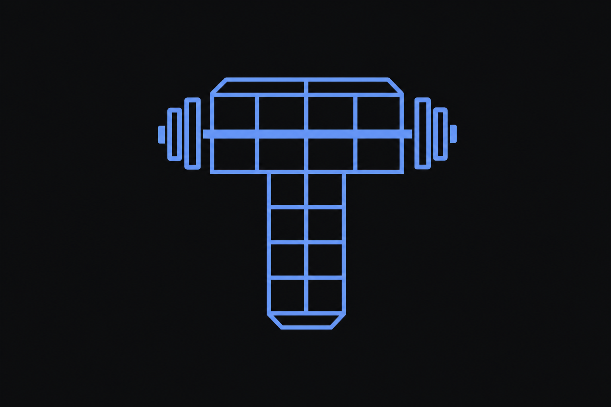
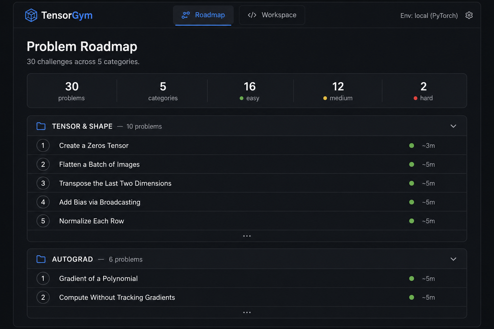
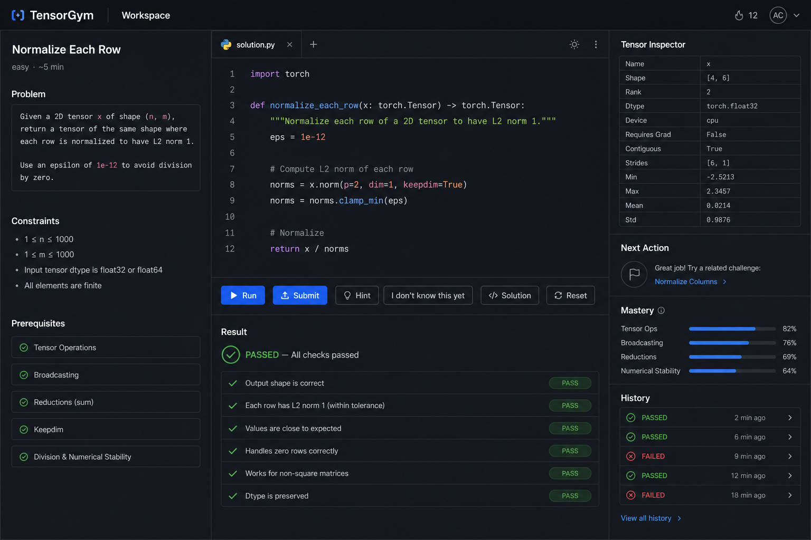

<p align="center">
  
</p>

<h1 align="center">TensorGym</h1>

<p align="center">
  Learn PyTorch by solving problems, not reading tutorials.
</p>

<p align="center">
  
  
  
  
  
  
  
</p>

---

TensorGym is a **challenge-first, documentation-grounded** learning platform for PyTorch. Pick a problem from the roadmap, write tensor code in the browser, and get instant feedback from a sandboxed executor — all without leaving the page.

<p align="center">
  
</p>

<p align="center">
  
</p>

## How it works

```
Roadmap → pick a challenge → write code → Run/Submit
                                              ↓
                            visible + hidden tests in Docker sandbox
                                              ↓
                          targeted feedback → mastery update → next problem
```

Stuck? Hit **"I don't know this yet"** to get a just-in-time Concept Capsule with an executable example and a warm-up exercise, then return to the original challenge with your code preserved.

## Features

| | |
|---|---|
| **30 challenges** | Across 5 categories: Tensor & Shape, Autograd, nn.Module, Debugging, Performance |
| **Curated roadmap** | Problems ordered by learning progression within each category, easy → hard |
| **Concept capsules** | 15 just-in-time micro-lessons with runnable examples and warm-ups |
| **Sandboxed execution** | All code runs in Docker with network isolation, memory caps, and timeouts |
| **Targeted feedback** | Mistake taxonomy maps errors to actionable next steps |
| **Tensor inspector** | See shape, dtype, grad_fn, and more for every output |
| **Mastery tracking** | Per-concept progress bars and attempt history |
| **Pinned environment** | PyTorch 2.12.0 CPU / Python 3.12 — reproducible results |

## Challenge categories

| Category | Count | Topics |
|---|---|---|
| Tensor & Shape | 10 | Creation, reshaping, broadcasting, indexing, normalization |
| Autograd | 6 | Gradients, no_grad, detach/clone, chain rule, higher-order |
| nn.Module & Training | 6 | Layers, optimizers, loss functions, train/eval, skip connections |
| Debugging | 4 | Shape mismatches, wrong reductions, missing grads, in-place errors |
| Performance | 4 | Vectorization, views vs copies, batched ops, memory optimization |

## Quick start

**Prerequisites:** Docker (running) and Python 3.11+ on the host.

```bash
# Clone
git clone https://github.com/apollofps/tensorgym.git
cd tensorgym

# Set up
make setup            # create venv + install host dependencies
make build-executor   # build the pinned PyTorch sandbox image

# Run
make run              # start API + UI at http://127.0.0.1:8000
```

Open [http://127.0.0.1:8000](http://127.0.0.1:8000) — you'll land on the problem roadmap.

## Tests

```bash
make test             # full suite (19 tests, requires Docker)
make test-fast        # unit tests only (no Docker)
```

Tests cover content verification (solutions run in Docker), executor security (network isolation, timeouts, AST checks), feedback taxonomy, and end-to-end flow including code preservation across restarts.

## Architecture

```
apps/web/              static UI — roadmap + workspace with CodeMirror editor
apps/api/app/          FastAPI backend — content, feedback, progress, execution
services/executor/     Dockerfile + runner.py (in-container) + docker_executor.py (host)
content/               challenges, capsules, warm-ups, source registries (YAML + Python)
tests/                 unit, executor security, content verification, e2e
docs/                  architecture, threat model, learner flows
```

## Security

Learner code never runs in the API process. Every execution happens in a disposable Docker container with:

- `--network none` — no internet access
- Memory, CPU, and PID limits
- Read-only filesystem
- Dropped capabilities + `no-new-privileges`
- Non-root user
- Wall-clock timeout with forced kill

See [`docs/THREAT_MODEL.md`](docs/THREAT_MODEL.md) for the full model and the tests that assert each constraint.

## Pinned environment

| | |
|---|---|
| PyTorch | 2.12.0 (stable, released 2025-05-13) |
| Python | 3.12 |
| Device | CPU only |
| Image | `tensorgym-executor:py312-torch2.12.0-cpu` |

All version claims are verified from official sources in [`RESEARCH_MANIFEST.md`](RESEARCH_MANIFEST.md).

## License

MIT
